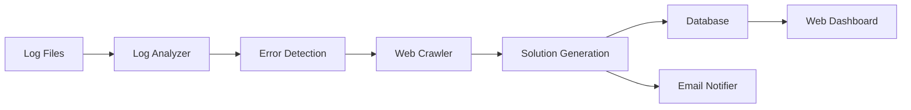

# 🔍 PyLoPi - Python Log Processor Intelligence

<div align="center">


**An intelligent, modular log monitoring and analysis system with AI-powered error detection and automated solutions**

[Features](#-features) • [Installation](#-installation) • [Usage](#-usage) • [Architecture](#-architecture) • [Configuration](#-configuration) • [Contributing](#-contributing)

</div>

---

## 🌟 Features

### Core Functionality
- **🤖 Intelligent Error Detection**: Automatically detects 15+ error types across multiple programming languages and platforms
- **🔍 AI-Powered Analysis**: Provides detailed analysis of errors with context-aware explanations
- **💡 Automated Solutions**: Suggests fixes and generates code snippets to resolve issues
- **📧 Email Notifications**: Real-time alerts with direct links to error analysis
- **🌐 Web Crawler Integration**: Searches for solutions across the web
- **📊 Real-time Dashboard**: Live monitoring with beautiful visualizations

### Technical Highlights
- **🧩 Modular Architecture**: Plugin-based system for easy extensibility
- **🌍 Multilingual Support**: Built-in English and Persian (Farsi) localization
- **⚡ High Performance**: Efficient log tailing with minimal resource usage
- **💾 SQLite Database**: Lightweight, zero-configuration data storage
- **🎨 Modern UI**: Responsive design with gradient animations and glass morphism
- **🔒 Secure**: No external dependencies for core functionality

### Supported Error Types
```
✓ SyntaxError          ✓ TypeError           ✓ ValueError
✓ AttributeError       ✓ NameError           ✓ ImportError
✓ IndexError           ✓ KeyError            ✓ FileNotFoundError
✓ PermissionError      ✓ RuntimeError        ✓ MemoryError
✓ RecursionError       ✓ ZeroDivisionError   ✓ HTTP Errors (404, 500, 403)
✓ DatabaseError        ✓ ConnectionError     ✓ TimeoutError
```

---

## 🚀 Installation

### Prerequisites
- Python 3.8 or higher
- pip (Python package manager)
- Modern web browser (Chrome, Firefox, Safari, Edge)

### Quick Start

1. **Clone the repository**
```bash
git clone https://github.com/PicoBaz/PyLoPi.git
cd PyLoPi
```

2. **Create virtual environment (recommended)**
```bash
python -m venv venv
source venv/bin/activate  # On Windows: venv\Scripts\activate
```

3. **Install dependencies**
```bash
pip install -r requirements.txt
```

4. **Run the application**
```bash
python app.py
```

5. **Open your browser**
```
http://localhost:5000
```

---

## 📖 Usage

### Basic Usage

1. **Start the application**
```bash
python app.py
```

2. **Configure log paths**
   - Navigate to the Dashboard
   - Add log file paths you want to monitor
   - Click "Start Monitoring"

3. **View analysis**
   - Errors appear in real-time on the dashboard
   - Click "View Details" for full analysis
   - Get automated solutions and code fixes

### Advanced Configuration

#### Email Notifications

1. Go to **Settings** tab
2. Enable email notifications
3. Configure SMTP settings:
```python
{
    "email_notifications": true,
    "email_address": "your-email@example.com",
    "smtp_server": "smtp.gmail.com",
    "smtp_port": 587,
    "smtp_username": "your-email@gmail.com",
    "smtp_password": "your-app-password"
}
```

#### Error Type Filtering

Select which error types to monitor:
- Navigate to Settings
- Check/uncheck error types
- Click "Save Settings"

### Supported Log Formats

PyLoPi works with various log formats:

**Python Applications**
```python
import logging
logging.basicConfig(filename='app.log', level=logging.ERROR)
```

**Web Servers (Apache/Nginx)**
```
ErrorLog /var/log/apache2/error.log
```

**Custom Applications**
- Any text-based log file
- Supports UTF-8 encoding
- Real-time tailing

---

## 🏗️ Architecture

### Project Structure
```
pylopi/
├── app.py                 # Main Flask application
├── database.py            # Database manager
├── log_analyzer.py        # Core analysis engine
├── email_notifier.py      # Email notification system
├── config_manager.py      # Configuration handler
├── requirements.txt       # Python dependencies
├── config.json           # User configuration (auto-generated)
├── pylopi.db             # SQLite database (auto-generated)
├── templates/
│   └── index.html        # Web interface
└── README.md             # This file
```

### System Flow



### Component Details

#### 1. Log Analyzer (`log_analyzer.py`)
- Real-time log monitoring
- Pattern matching for error detection
- Context-aware analysis
- Solution generation

#### 2. Database Manager (`database.py`)
- SQLite-based storage
- Thread-safe operations
- Efficient querying
- Statistics generation

#### 3. Email Notifier (`email_notifier.py`)
- HTML email templates
- SMTP integration
- Severity-based alerting
- Direct dashboard links

#### 4. Config Manager (`config_manager.py`)
- JSON-based configuration
- Default settings
- Hot-reload support
- Validation

---

## ⚙️ Configuration

### Configuration File (`config.json`)

```json
{
    "language": "en",
    "email_notifications": false,
    "email_address": "",
    "smtp_server": "smtp.gmail.com",
    "smtp_port": 587,
    "smtp_username": "",
    "smtp_password": "",
    "enabled_error_types": [
        "SyntaxError",
        "TypeError",
        "ValueError",
        "AttributeError",
        "NameError",
        "ImportError",
        "IndexError",
        "KeyError",
        "FileNotFoundError",
        "404Error",
        "500Error",
        "DatabaseError",
        "ConnectionError"
    ],
    "log_retention_days": 30,
    "max_logs_per_file": 10000,
    "monitoring_interval": 2
}
```

### Environment Variables

You can also use environment variables:
```bash
export PYLOPI_SMTP_USERNAME="your-email@gmail.com"
export PYLOPI_SMTP_PASSWORD="your-app-password"
export PYLOPI_PORT=5000
```

---

## 🔌 Extending PyLoPi

### Adding New Error Types

Edit `log_analyzer.py`:
```python
self.error_patterns = {
    'CustomError': r'CustomError:(.+)',
    # Add your pattern here
}
```

### Creating Custom Analyzers

Create a new file `custom_analyzer.py`:
```python
class CustomAnalyzer:
    def analyze(self, log_line):
        # Your custom logic
        return analysis_result
```

### Adding New Languages

Edit the `translations` object in `templates/index.html`:
```javascript
const translations = {
    es: {
        title: "PyLoPi",
        subtitle: "Monitor y Análisis Inteligente de Logs",
        // Add more translations
    }
};
```

---

## 📊 API Endpoints

### REST API

| Endpoint | Method | Description |
|----------|--------|-------------|
| `/api/config` | GET | Get current configuration |
| `/api/config` | POST | Update configuration |
| `/api/start-monitoring` | POST | Start log monitoring |
| `/api/stop-monitoring` | POST | Stop log monitoring |
| `/api/logs` | GET | Get recent logs |
| `/api/log/<id>` | GET | Get log details |
| `/api/stats` | GET | Get statistics |
| `/api/language` | POST | Set interface language |

### Example API Usage

```python
import requests

response = requests.post('http://localhost:5000/api/start-monitoring', 
    json={'log_paths': ['/var/log/app.log']})

logs = requests.get('http://localhost:5000/api/logs?limit=10').json()
```

---

## 🎨 UI Features

### Dashboard
- **Live Statistics**: Total logs, today's count, critical errors
- **Recent Logs**: Latest errors with quick preview
- **Monitoring Control**: Start/stop monitoring interface
- **Log Path Management**: Add/remove paths dynamically

### Logs View
- **Filterable List**: All logged errors
- **Severity Indicators**: Color-coded badges
- **Quick Access**: Direct links to full analysis

### Log Detail View
- **Full Analysis**: Complete error breakdown
- **Solution Steps**: Step-by-step fix instructions
- **Code Snippets**: Ready-to-use code fixes
- **Full Log Context**: Original log entry

### Settings
- **Email Configuration**: SMTP setup
- **Error Filters**: Choose which errors to track
- **Language Selection**: Switch between English/Persian
- **Preferences**: Customize monitoring behavior

---

## 🧪 Testing

### Manual Testing
```bash
# Create a test log file
echo "TypeError: unsupported operand type(s)" >> test.log

# Start PyLoPi and add test.log
# Error should appear in dashboard
```

### Unit Tests (Coming Soon)
```bash
python -m pytest tests/
```

---

## 🛠️ Troubleshooting

### Common Issues

**Port already in use**
```bash
# Change port in app.py
app.run(debug=True, host='0.0.0.0', port=5001)
```

**Email notifications not working**
- Enable "Less secure app access" for Gmail
- Use app-specific password for Gmail
- Check SMTP settings

**Logs not appearing**
- Verify file path is correct
- Check file permissions
- Ensure log file exists

**Database locked error**
- Close other connections to pylopi.db
- Restart the application

---

## 🤝 Contributing

We welcome contributions! Here's how:

1. **Fork the repository**
2. **Create a feature branch**
   ```bash
   git checkout -b feature/amazing-feature
   ```
3. **Commit your changes**
   ```bash
   git commit -m 'Add amazing feature'
   ```
4. **Push to the branch**
   ```bash
   git push origin feature/amazing-feature
   ```
5. **Open a Pull Request**

### Contribution Guidelines
- Follow PEP 8 style guide
- Add docstrings to functions
- Update README for new features
- Test thoroughly before submitting

---


## 👥 Authors

- **Mehdi** - *Initial work* - [PicoBaz](https://github.com/PicoBaz)

---

## 🙏 Acknowledgments

- Flask framework for the web interface
- BeautifulSoup for web crawling
- SQLite for reliable data storage
- The open-source community

---

## 📞 Support

- **Email**: picobaz3@gmail.com

---

<div align="center">


Made with ❤️ by developers, for developers


</div>